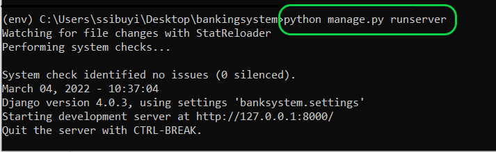
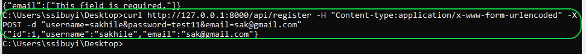
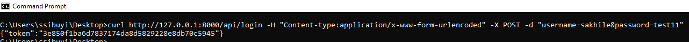
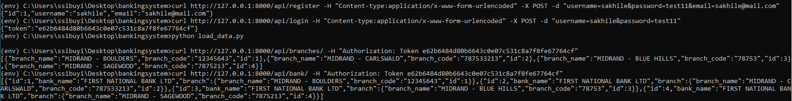
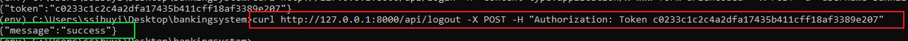
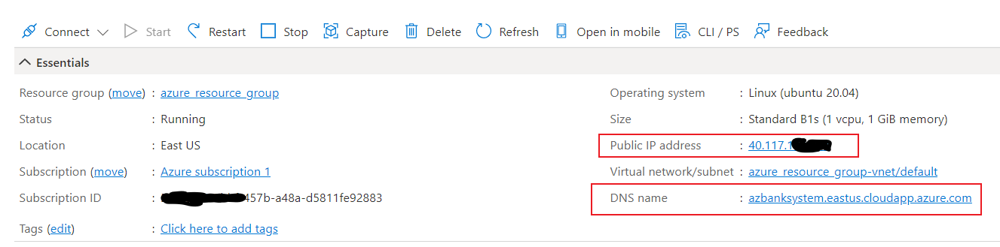
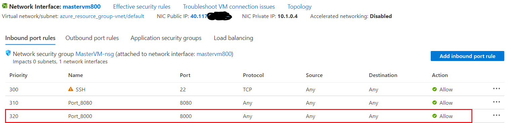

# BANK SYSTEM DJANGO APP
This project can run locally i.e. on your machine or deployed via a docker container. the steps below are meant to help you get the up running on your local machine and also deploying it using a Docker container.

#  Running the project
## Local Machine.
### Prerequisites
You must have command line to execute most of the commands I was working on an Ubuntu 18.04 terminal, you can also run your commands on Windows(CMD).
Make sure you have the packages below installed.
 - Python
 - virtualenv / python-venv
 - pip
 - The other dependencies will be installed using the requirements.txt file.
 ---
 clone the repository to local `git clone https://github.com/sakhilesibuyi/bankingsystem.git` this will clone the repo into bankingsystem locally.
 navigate into the cloned repo `cd bankingsystem` 
 While inside the bankingsystem Directory/folder Run the following using cmd/terminal session
 1. Create python environment `python -m venv env`
 2. activate your environment linux `source env/bin/activate` windows env\Scripts\activate.bat
 3. install packages `pip install -r requirements.txt` this will install all required packages on your machine.** if on windows open the requirements.txt and comment uWSGI this   module doesn't work on a bare windows environment. 
 4. Start the app `python manage.py runserver` on first run you will notice that the app suggest that you do migrations to migrate models into db
 5. stop the app and run `python manage.py migrate` this will apply the models into the db.
 6. Run the app again using the command in step 4
 
 7. Populate the Database with some data `python load_data.py` to confirm if the insert was successful check logs in the file named app.log on your current working directory
 8. you can use curl or postman to make requests into the api. we will use curl
    - Register a new User ` curl http://127.0.0.1:8000/api/login -H "Content-type:application/x-www-form-urlencoded" -X POST -d "email=yourEmail&username=YourUsername&password=yourPassword"`
    
    - login with the new created user ` curl http://127.0.0.1:8000/api/login -H "Content-type:application/x-www-form-urlencoded" -X POST -d "username=yourUSername&password=yourPassword"` you will get a token and that token should be included with all other requests that you make.
    
    - retrive available branches `curl http://127.0.0.1:8000/api/login -H "Authorization: Token {yourToken}"
    
    - Logout `curl http://127.0.0.1:8000/api/logout -X POST -H "Authorization: Token yourTokenhere"`
    
    - ### Available Endpoints
      * list of branches  [http://127.0.0.1:8000//api/branches/]   methods=>[GET,POST]
      * list of banks http://127.0.0.1:8000//api/banks/  methods=>[GET,POST]
      * get list of accounts http://127.0.0.1:8000/api/accounts/  methods=>[GET,POST]
      * bank detail http://127.0.0.1:8000/api/bank/<int:id>/  methods=>[GET,PUT,DELETE]
      * branch detail http://127.0.0.1:8000/api/branch/<int:id>/   methods=>[GET,PUT,DELETE]
      * account detail http://127.0.0.1:8000/api/account/<int:id>/   methods=>[GET,PUT,DELETE]
      * perform a withdrawal http://127.0.0.1:8000/api/withdrawals/  methods=>[POST]
      * perform a deposit http://127.0.0.1:8000/api/deposit/ methods=>[POST]
      * perform a transfer http://127.0.0.1:8000/api/transfers/ methods=>[POST]
      * get transactions http://127.0.0.1:8000/api/transfers/ methods=>[GET,POST]
## Docker container on Azure VM.
you can also deploy the application into a docker container hosted in Azure Virtual machine.

### Setup the application employs DEV OPS Principles
We will be using Ubuntu(18.04) running on windows Hyper-V
### Prerequisites
- Ansible
- Python
- docker
- jenkins server
- Azure Account(Assuming that you already have an account and done your setup.)
  - Provision a Virtual Machine ** The app can also be deployed using  Azure Container service.
  - You can also use Terraform to provision your VM - please not should you wish to use terraform then use the file named  (provision.tf)
  - Once your VM or VM's have been provisioned Take note of:
     - Public IP Address
     - DNS name if enabled.
     
     - Make sure that to create a firewall ingress rule for allowing tcp connection on port 8000 exists this is to open port 8000 which is the port that our container listens to, in short we will bind this container port to the host(VM) port.
     
     - in your cloned app make sure to navigate into settings.py and add your VM's public IP address and dns name if any.
     
