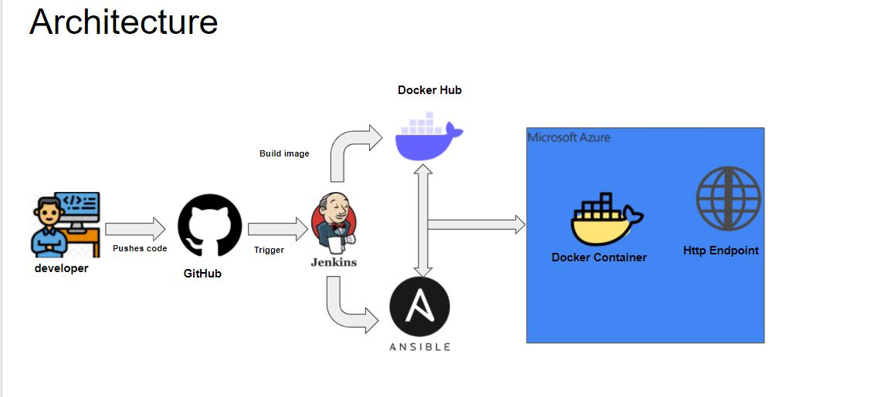
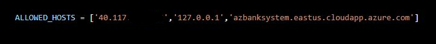
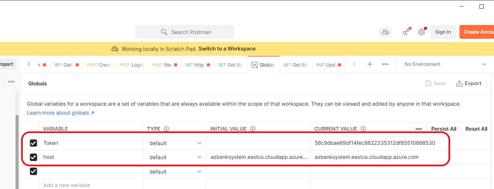
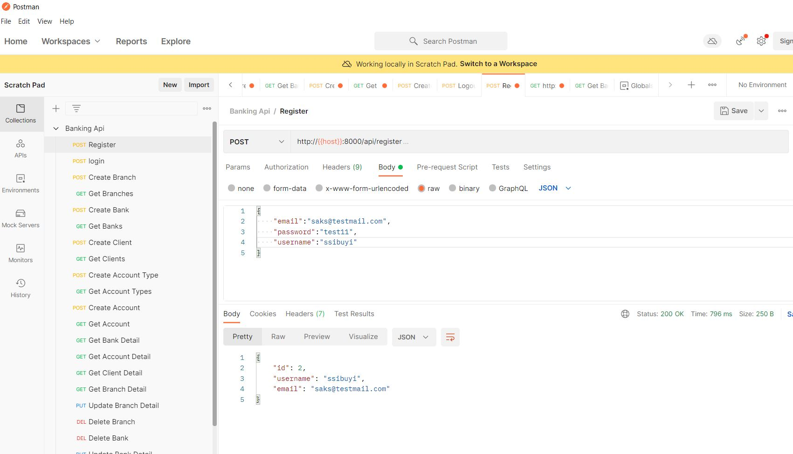
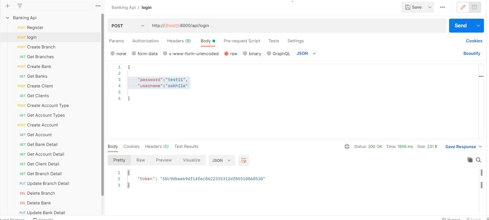
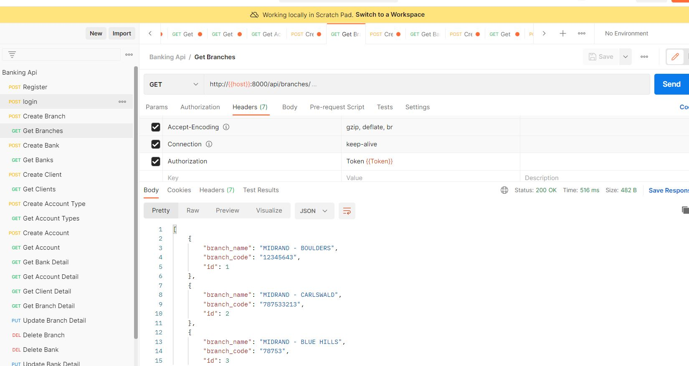
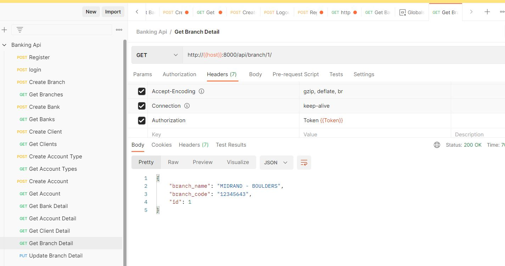
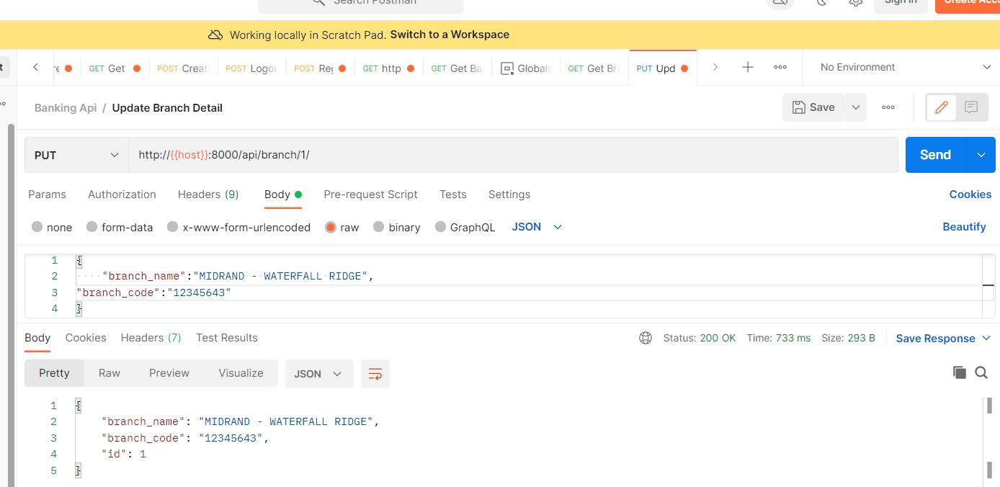
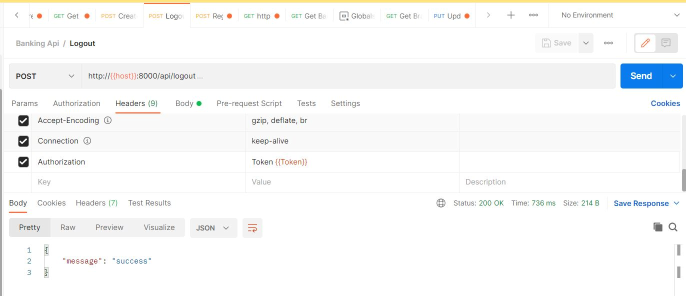
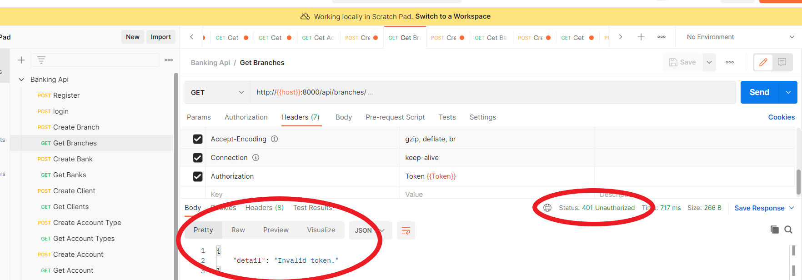

# BANK SYSTEM DJANGO APP
This project can run locally i.e. on your machine or deployed via a docker container. the steps below are meant to help you get the up running on your local machine and also deploying it using a Docker container.

#  Running the project
## Local Machine.
### Prerequisites
You must have command line to execute most of the commands I was working on an Ubuntu 18.04 terminal, you can also run your commands on Windows(CMD).
Make sure you have the packages below installed.
 - Python
 - virtualenv / python-venv
 - pip
 - The other dependencies will be installed using the requirements.txt file.
 ---
 clone the repository to local `git clone https://github.com/sakhilesibuyi/bankingsystem.git` this will clone the repo into bankingsystem locally.
 navigate into the cloned repo `cd bankingsystem` 
 While inside the bankingsystem Directory/folder Run the following using cmd/terminal session
 1. Create python environment `python -m venv env`
 2. activate your environment linux `source env/bin/activate` windows env\Scripts\activate.bat
 3. install packages `pip install -r requirements.txt` this will install all required packages on your machine.** if on windows open the requirements.txt and comment uWSGI this   module doesn't work on a bare windows environment. 
 4. Start the app `python manage.py runserver` on first run you will notice that the app suggest that you do migrations to migrate models into db
 5. stop the app and run `python manage.py migrate` this will apply the models into the db.
 6. Run the app again using the command in step 4
 
 7. Populate the Database with some data `python load_data.py` to confirm if the insert was successful check logs in the file named app.log on your current working directory
 8. you can use curl or postman to make requests into the api. we will use curl
    - Register a new User ` curl http://127.0.0.1:8000/api/login -H "Content-type:application/x-www-form-urlencoded" -X POST -d "email=yourEmail&username=YourUsername&password=yourPassword"`
    
    - login with the new created user ` curl http://127.0.0.1:8000/api/login -H "Content-type:application/x-www-form-urlencoded" -X POST -d "username=yourUSername&password=yourPassword"` you will get a token and that token should be included with all other requests that you make.
    
    - retrive available branches `curl http://127.0.0.1:8000/api/login -H "Authorization: Token {yourToken}"
    
    - Logout `curl http://127.0.0.1:8000/api/logout -X POST -H "Authorization: Token yourTokenhere"`
    
    - ### Available Endpoints
      * list of branches  [http://127.0.0.1:8000//api/branches/]   methods=>[GET,POST]
      * list of banks http://127.0.0.1:8000//api/banks/  methods=>[GET,POST]
      * get list of accounts http://127.0.0.1:8000/api/accounts/  methods=>[GET,POST]
      * bank detail http://127.0.0.1:8000/api/bank/<int:id>/  methods=>[GET,PUT,DELETE]
      * branch detail http://127.0.0.1:8000/api/branch/<int:id>/   methods=>[GET,PUT,DELETE]
      * account detail http://127.0.0.1:8000/api/account/<int:id>/   methods=>[GET,PUT,DELETE]
      * perform a withdrawal http://127.0.0.1:8000/api/withdrawals/  methods=>[POST]
      * perform a deposit http://127.0.0.1:8000/api/deposit/ methods=>[POST]
      * perform a transfer http://127.0.0.1:8000/api/transfers/ methods=>[POST]
      * get transactions http://127.0.0.1:8000/api/transfers/ methods=>[GET,POST]
---
## Docker container on Azure VM.
you can also deploy the application into a docker container hosted in Azure Virtual machine.

### the application employs DEV OPS Principles

We will be using Ubuntu(18.04) running on windows Hyper-V
Throughout the following steps we will assume that you have some knowledge around:
   - Working with Docker containers [Docker](https://www.docker.com/get-started)
   - Working with Ansible [Ansible](https://www.ansible.com/resources/get-started?hsLang=en-us)
   - Working with Terraform **(Optional)**  [Terraform](https://www.terraform.io/intro)
   - Working knowledge around Unix 
   - Working with Jenkins. [Jenkins](https://www.jenkins.io/doc/book/)
### Prerequisites
- Ansible
- Python
- docker
- jenkins server
- Azure Account(Assuming that you already have an account and done your setup.)
  - Provision a Virtual Machine ** The app can also be deployed using  Azure Container service.
  - You can also use Terraform to provision your VM 
     > **please note should you wish to use terraform then use the file named  (provision.tf)**
  - Once your VM or VM's have been provisioned Take note of:
     - Public IP Address
     - DNS name if enabled.
     
     - Make sure that to create a firewall ingress rule for allowing tcp connection on port 8000 exists this is to open port 8000 which is the port that our container listens to, in short we will bind this container port to the host(VM) port.
     
     - in your cloned app to navigate into bankingsystem/settings.py and add your VM's public IP address and dns name if any.
     
- create a jenkins pipeline make sure you update your own docker hub credentials by creating a credentials variable(dockerPassword) in jenkins credentials manager

```pipeline{
	agent any
	environment {
  	DOCKER_TAG = getCommitID()
	}
	stages{
    	stage('SCM'){
        	steps{
            	git credentialsId: 'git',
            	url: 'https://github.com/sakhilesibuyi/bankingsystem'
        	}
    	}
    	stage('Docker Build'){
        	steps{

            	sh "docker build . -t saksman3/banksystem:${DOCKER_TAG}"
        	}
   	}
    	stage('Push Docker Hub'){
        	steps{
            	withCredentials([string(credentialsId: 'docker_login', variable: 'dockerPassword')]) {
              	sh "docker login -u saksman3 -p ${dockerPassword}"
            	}
            	sh "docker push saksman3/banksystem:${DOCKER_TAG}"
        	}
   	}
   	stage('Deploy Container'){
       	steps{
          	ansiblePlaybook disableHostKeyChecking: true,
          	extras: '-e DOCKER_TAG=${DOCKER_TAG}',
          	installation: 'ansible',
          	inventory: '/etc/ansible/hosts',
          	playbook: 'banksystem-playbook.yml'
       	}
   	}
	}
}

def getCommitID(){
	def commitID = sh returnStdout: true, script: 'git rev-parse --short HEAD'
	return commitID
}
```
  - this pipeline will be used to
    - clone the repo
    - build the image based on the Dockerfile inside the cloned Repo
    - push the image into Docker hub **you can use any other storage service like google cloud container registry**
    - trigger Ansible deployment playbook **Configuration of the playbook included in file ansible-playbook.yml**

  - Once you have done :monocle_face: with all above steps, build the pipeline and you should see the steps and statuses as in the picture below:
   

## Assuming that all steps above were successfull
We will test this using postman you can download it here [postman](https://www.postman.com/downloads/), you can also use the browser version.
- from postman I have created a collection with all the endpoints available
- I have also added postman global variables to store:
  - Token - token that we will get upon successfull authentication.
  - Host - the hostname(local or azure hosted)
  
### Send a Login Request:
 [register Request](http://azbanksystem.eastus.cloudapp.azure.com:8000/api/register)


### Register a new User:
 [Login Request](http://azbanksystem.eastus.cloudapp.azure.com:8000/api/login)



### Get Branches
[Get Branches](http://azbanksystem.eastus.cloudapp.azure.com:8000/api/branches/)


### Get Branch Details by ID
[Get Branch](http://azbanksystem.eastus.cloudapp.azure.com:8000/api/branch/1/)


### Edit Branch
[Edit Branch](http://azbanksystem.eastus.cloudapp.azure.com:8000/api/branch/1/)

### Logout
[Logout](http://azbanksystem.eastus.cloudapp.azure.com:8000/api/logout)

### GET BRANCHES AFTER LOGGING OUT


